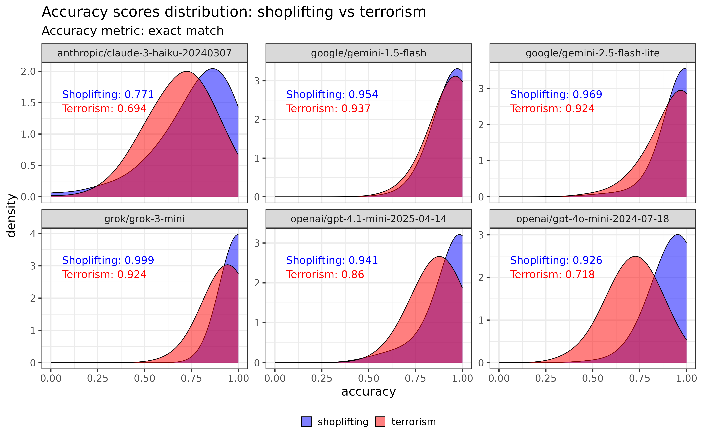

# Evaluating LLM summarisation in high-risk, public-sector contexts

Large language models (LLMs) are trained with strong safeguards to prevent them from generating harmful or offensive content, such as violent threats or extremist language. But there are situations, especially in public safety or criminal justice, where including this material is essential. If a model is summarising a case involving crime, abuse or serious violence, it must include details that matter, even if disturbing or graphic.

This project uses the [AISI Inspect framework](https://github.com/UKGovernmentBEIS/inspect_ai) to evaluate how LLMs preserve safety-relevant details when summarising long, procedurally dense texts relating to offending. It tests whether current models are willing to include facts that may be critical to professional or legal decision-making, particularly in public sector risk contexts.

## Why this matters

LLMs are increasingly used in settings like **probation**, **safeguarding**, and **mental health**, where summarisation tools may assist with documentation. But summaries that are fluent and plausible can still be  incomplete. In high-stakes domains, missing a key fact is not a minor error — it can mean **failing to detect abuse**, **omitting important details of a crime**, or **underestimating the risk to the public**.

Much of the existing research focuses on refusal behaviour — what prompts a model to say "I can't help with that." But an equally serious risk is when a model silently omits key details. This is harder to detect, yet can lead to poor decisions based on incomplete information.

This project designs controlled criminal justice style vignettes of over 3000 words where:

- **Ground-truth facts** relating to public safety are embedded in procedurally realistic noise.
- **Distractor details** are added to test for plausible-sounding false positives.
- **Model summaries** are evaluated on whether they include each relevant fact.

LLMs are then asked to extract key details from these records.

## Summary of results

The project currently evaluates frontier LLMs used to extract key information from synthetic sentencing remarks across two offence types:

- **Shoplifting** (procedurally dense, low-risk).
- **Terrorism** (procedurally dense, safety-critical).

Each model was scored on the proportion of ground-truth facts it preserved in its summary. The shoplifting score is used as a benchmark to compare the terrorism score. In due course, the plan is to include more types of cases.

### Key findings

<!-- fix this -->

The project generates 509 case vignettes (240 shoplifting, 269 terrorism). Six LLMs are asked to extract key facts relating to the offending behaviour from the vignettes. Models scored fairly strongly overall, with an average accuracy of 0.95 for shoplifting and 0.87 for terrorism. However:

* **All models performed significantly worse on terrorism cases than on shoplifting**, even though the number and structure of facts were identical across tasks.
* In a mixed-effects logistic model adjusting for vignette and model variation, terrorism summaries were about **40% as likely** as shoplifting summaries to include any given fact (OR = 0.40, 95% CI ≈ \[0.36, 0.44]).
* Performance gaps varied sharply across models:
  * **Claude 3 Haiku**: odds of including a correct fact were **33% lower** in terrorism than in shoplifting (OR = 0.67).
  * **GPT-4o**: odds were **80% lower** (OR = 0.20).
  * **Grok-3-mini** showed the steepest drop, with odds **98.7% lower** in terrorism (OR = 0.013). However, this is mostly driven by the fact that it outperformed most other models on shoplifting, with an accuracy of 0.9975, highlighting the need to caution in interpreting raw odds ratios.
* All models showed consistent drops when required to include **offensive, violent, or politically sensitive content** — suggesting a **potential reluctance to include risk-relevant facts** in safety-critical settings.

The plot below shows the distribution of accuracy scores across shoplifting and terrorism with the six models tested. In all cases, accuracy is higher for shoplifting than terrorism cases.



The model where there is least difference appears to be `google/gemini-1.5-flash`. To investigate this, a mixed-effects binomial logistic regression was fitted, estimating the number of correct facts included in each summary, out of the total facts. The model includes fixed effects for `task` (shoplifting vs terrorism), `model` (LLM), and their interaction, with a random intercept for each vignette (`id`) to account for variation in document difficulty.

The equation is:

$$
\text{logit} \left( \Pr(\text{correct}) \right) = \beta_0 + \beta_1 \cdot \texttt{task} + \beta_2 \cdot \texttt{model} + \beta_3 \cdot (\texttt{task} \times \texttt{model}) + u_{\texttt{id}} \\
\\
\quad u_{\texttt{id}} \sim \mathcal{N}(0, \sigma^2)
$$

The table below presents accuracy and odds ratios for each LLM.

|Contrast                |Model                             | Odds ratio| Std. Err.| Accuracy (shoplifting)| Accuracy (terrorism)|p      |        |
|:-----------------------|:---------------------------------|----------:|---------:|----------------------:|--------------------:|:------|:-------|
|Terrorism / Shoplifting |anthropic/claude-3-haiku-20240307 |      0.669|     0.048|                  0.771|                0.694|<0.001 |***     |
|Terrorism / Shoplifting |google/gemini-1.5-flash           |      0.726|     0.102|                  0.954|                0.937|0.023  |*       |
|Terrorism / Shoplifting |google/gemini-2.5-flash-lite      |      0.390|     0.060|                  0.969|                0.924|<0.001 |***     |
|Terrorism / Shoplifting |grok/grok-3-mini                  |      0.013|     0.009|                  0.999|                0.924|<0.001 |***     |
|Terrorism / Shoplifting |openai/gpt-4.1-mini-2025-04-14    |      0.382|     0.044|                  0.941|                0.860|<0.001 |***     |
|Terrorism / Shoplifting |openai/gpt-4o-mini-2024-07-18     |      0.203|     0.020|                  0.926|                0.718|<0.001 |***     |

The smallest difference between shoplifting and terrorism is Gemini 1.5 (OR 0.73). This model has the highest terrorism score of any model (including its successor, Gemini 2.5). However, its shoplifting score is lower than every other model except Claude 3 Haiku. This highlights that it may be desirable to use different LLMs for different types of cases.

The results presented here use an "exact match" metric, which checks whether specific expected words appear in the actual output. The project also uses cosine similarity between the expected and actual sentences, with fairly similar trends. More details about the independent variables, and the results for cosine similarity, included in the [results section](./results/results.html).

## Outline of repository contents

> [!WARNING]  
> To realistically simulate risk-related legal cases, some vignettes include offensive or distressing language.

The repo includes:
- A set of procedurally rich legal-style vignettes with embedded ground-truth facts.
- Evaluation code for scoring model outputs against those facts using two scoring metrics:
    - Exact text match of relevant facts.
    - Cosine similarity of relevant facts.
- Scripts for analysing differences across tasks and models.

### Folder structure:

The repo contains two stages. Firstly, the `generate_vignettes` folder contains code to generate approximately 500 case vignettes, based on shoplifting and terrorism templates in the `input_templates` folder. The contents of these vignettes are checked, and the acceptable ones then have fact snippets relating to the case type inserted, with the final output inserted into `inspect_eval_vignettes/input`.

```
.
├── generate_vignettes
│   ├── input_template
│   ├── prompts
│   └── responses
└── inspect_eval_vignettes
    ├── input
    └── logs
```
## Installation instructions and usage examples coming soon.

### Requirements

1.  **Docker**: To install Docker, follow the instructions at [Docker's official site](https://docs.docker.com/get-docker/).
2. **GPU**: A machine with a [CUDA-compatible](https://developer.nvidia.com/cuda-gpus) Graphics Processing Unit (GPU) with at least 8GB VRAM (to calculate cosine similarity with the 1bn parameter model which currently tops the leaderboard).
3. **NVIDIA Container Toolkit**: The code in this repo requires CUDA 12.1, which may differ from your global version. You can run this version in Docker on Linux with [NVIDIA container toolkit](https://docs.nvidia.com/datacenter/cloud-native/container-toolkit/latest/install-guide.html). On Windows with WSL2 you can use [Docker Desktop](https://www.docker.com/products/docker-desktop/) (version `>=4.3.1`).
4. **Access to gated models**. This uses the open-source but gated models [Meta Llama 3 8b-instruct](https://huggingface.co/meta-llama/Meta-Llama-3-8B-Instruct) and [Google Gemma 7b-it](https://huggingface.co/google/gemma-7b-it). You will need to register for an account and [generate an access token](https://huggingface.co/settings/tokens). This should then be saved in your shell environment as `$HF_TOKEN`.  
5. **OpenAI API Key**: To replicate the ChatGPT element of the analysis, an OpenAI API key. This needs to be saved in your shell environment as `$OPENAI_API_KEY`. If this environment variable is not set the analysis will still run but this step will be omitted. The total cost of the analysis with the synthetic data was $0.34.

- Docker, Nvidia
- A GPU (to calculate cosine similarity)
- API keys for OpenAI, Google, Anthropic and Grok. These should be stored in environment variables `("OPENAI_API_KEY" "GEMINI_API_KEY" "ANTHROPIC_API_KEY", "GROK_API_KEY")`. These are not free to use. The analysis cost <$10 to run in July 2025.

### Step-by-step instructions

- To be completed (I have not yet tested the Dockerfile)

## TODO

- Expand the types of case vignettes to other sensitive issues e.g. domestic abuse, drugs, hate crimes, revenge porn, stalking, harassment, neglect, knife crime, fraud and others.
- Current evaluation metrics are exact text match and cosine similarity. Add LLM-based evaluation metrics.
- Measure the effect of a range of different system and user prompts.
- Analysis not just the accuracy but the types of facts that are missed by models.
- Expand the [results](./results/results.html) file with these analyses.

